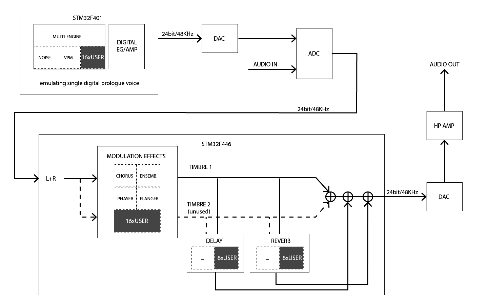

# Prologue Rev.A - Superbooth 2018 Edition

This board consists of a single digital voice of the [prologue synthesizer](http://korg.com/prologue) along with the effects processor. It provide a realistic runtime environment to test custom oscillator and effects code without needing an actual prologue device. This board was produced as a one off run and is not available for sale.

**Note: The analog VCAs of the prologue were not included on this board. Enveloppes are simulated in software on the voice microcontroller and as of the latest firmware version are causing some unwanted sonic artefacts. This platform is aimed for testing only and may not be suitable to be used as full blown instrument.**

**Note: If you received a board during Superbooth 18, please update the firmware by following the steps below before loading custom oscillators and effects**

**Warning: A problem has been found with the reset switch. When pressed multiple times, the main microcontroller goes into full read protection mode, preventing normal operation. The chip is however recoverable by using ST's DeFuse Demo tool and the recovery DFU system. (See Last Resort Recovery section). System 1.17 and up prevents this issue.**

## Specs

* STM32F4 series microcontrollers
* 8MB SDRAM
* 4MB external nor flash
* Stereo mini-jack audio in/out
* Digital volume control knob
* USB MIDI
* +12VDC power (center +)
* Reset and boot switches

## Signal Path

## MIDI Implementation

Here is the subset of the prologue's MIDI implementation that is relevant to the board:

|     Function      |             |  Remarks                                 |
|:-----------------:|:-----------:|:----------------------------------------:|
| Basic Channel     |      1      |                                          |
| Note Number       |    0-127    |                                          |
| Velocity (NoteOn) |    1-127    |                                          |
| Pitch Bend        |     yes     |                                          |
| CC 5              |             | Portamento                               |
| CC 16, 17, 18, 19 |             | Amp. EG. Attack, Decay, Sustain, Release | 
| CC 20, 21, 22, 23 |             | Mod. EG. Attack, Decay, Sustain, Release | 
| CC 24, 26         |             | LFO Rate, Intensity                      |
| CC 28, 29         |             | Mod. FX Speed, Depth                     |
| CC 30, 31         |             | Delay/Reverb Time, Depth                 |
| CC 42             |             | Pitch EG. Intensity                      |
| CC 52, 53, 54     |             | Multi-Engine Octave, Type, Shape         | 
| CC 56, 57, 58     |             | LFO Target, Wave, Mode                   | 
| CC 88, 89         |             | Mod. FX Type, Delay/Reverb FX Type       |
| CC 92, 94         |             | Mod. FX on/off, Delay/Reverb FX on/off   |
| CC 96, 97         |             | Mod. FX Subtype Delay/Reverb FX Subtype  |

Refer to the [prologue owner's manual](http://www.korg.com/us/support/download/manual/0/778/3798/) for details on each parameter.

### Board Specific CC Messages

|     Function      |             |  Remarks                                 |
|:-----------------:|:-----------:|:----------------------------------------:|
| CC 70-75          |             | User Osc. Edit Parameter 1-6             |

Note: The values for these messages are not scaled to fit the parameter's type and range, they will be clipped to the min/max range, but due to the limited 7 bit resolution bipolar percent types cannot be supported.

## Firmware Update

**v1.17 beta**
* *Windows* : [prologue-devboard-rev_a-system-v1.17b.zip](http://cdn.storage.korg.com/korg_SDK/prologue-devboard-rev_a-system-v1.17b.zip) (SHA1: a5f1c7ca61871c348f339ead72b457d16ca3ee7f)
* *OSX* : [prologue-devboard-rev_a-system-v1.17b.dmg](http://cdn.storage.korg.com/korg_SDK/prologue-devboard-rev_a-system-v1.17b.dmg) (SHA1: 37c7add3338b2c1edcdf6907beb356cdb1af0363)

See the included README.md file for update instructions.

### Last Resort Recovery

A DFU file is bundled with the system. It is formated for use with ST Microelectronics DefuSeDemo tool.
In order to boot the board in DFU mode. Connect the board via USB to your computer and short pads 2 and 5 of the serial connector next to C97 (close to the power connector) while tapping the reset switch. The board should then be visible to the [DefuseDemo tool](http://www.st.com/en/development-tools/stsw-stm32080.html).

